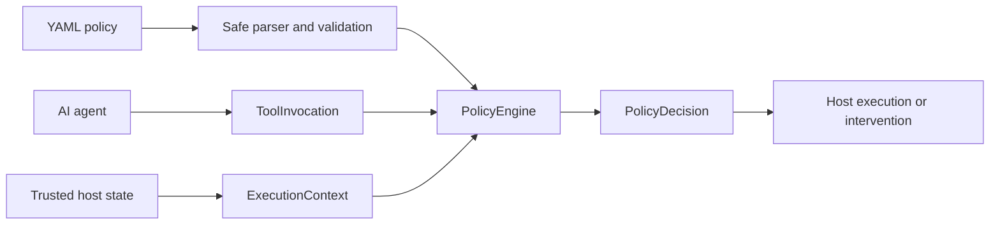

# ToolPolicy

**Deterministic runtime authorization for AI-agent actions.**

AI agents should not decide their own permissions. ToolPolicy evaluates
proposed tool calls against explicit policies before execution.

```text
AI Agent
    ↓
ToolInvocation
    ↓
ToolPolicy
    ↓
ALLOW / DENY / REQUIRE_APPROVAL
    ↓
Tool execution or intervention
```

ToolPolicy is a small Python library and CLI for evaluating a typed tool
invocation against a declarative YAML policy. Policy evaluation is
deterministic: no LLM participates in authorization decisions.

```yaml
version: "1"

tools:
  transfer_funds:
    risk: consequential
    decision: require_approval
    constraints:
      - source: arguments
        field: amount
        operator: less_than_or_equal
        value: 5000
        on_failure: deny
```

## Why ToolPolicy Exists

An agent can propose an action, but it must not be able to grant itself
permission to perform it. ToolPolicy places deterministic policy evaluation
between a proposed tool call and its execution. The host application owns tool
execution and must honor the returned decision.

ToolPolicy is deliberately small. It is not a complete enterprise authorization
system, and it does not replace authentication, identity management, approval
workflows, or an application's own security controls.

## Quick Example

The repository includes an entirely synthetic
[banking-agent example](examples/banking-agent/policy.yaml). It demonstrates
safe reads, trusted-context checks, approval requirements, argument limits,
destructive-action denial, and unknown-tool denial. Banking concepts exist only
in this example; they are not part of the generic engine.

```shell
toolpolicy check \
  --policy examples/banking-agent/policy.yaml \
  --tool transfer_funds \
  --arg amount=7500
```

The command returns `DENY` and exits with code `10` because the configured
limit is `5000`.

## Installation

ToolPolicy targets Python 3.14. From a clone of this repository:

```shell
python3.14 -m venv .venv
source .venv/bin/activate
python -m pip install -e ".[dev]"
```

This project is not published to PyPI yet. To install a pinned source revision
in another project, use:

```shell
python -m pip install "git+https://github.com/<owner>/toolpolicy.git@<revision>"
```

## Quick Start

Evaluate the included example through the CLI:

```shell
toolpolicy check \
  --policy examples/banking-agent/policy.yaml \
  --tool get_customer
```

That command returns `ALLOW` and exits `0`.

## Policy Format

Policies are YAML documents with a fixed V1 schema. Unknown fields, unsupported
versions, risk levels, outcomes, operators, and malformed constraints are
rejected during loading; they are never silently ignored.

```yaml
version: "1"

tools:
  get_account_balance:
    risk: read
    decision: allow
    constraints:
      - source: context
        field: customer_verified
        operator: equals
        value: true
        on_failure: deny
```

Each tool has a `risk`, a base `decision`, and optional constraints. Constraint
sources are explicitly limited to a top-level `arguments` or `context` field.

## Policy Outcomes

V1 supports exactly three outcomes:

| Outcome | Meaning |
| --- | --- |
| `ALLOW` | The host may execute the tool. |
| `DENY` | The host must not execute the tool. |
| `REQUIRE_APPROVAL` | The host must obtain its own approval before execution. |

`DENY` and `REQUIRE_APPROVAL` are normal authorization results, not exceptions.

## Risk Levels

Risk is descriptive policy metadata. It does not implicitly authorize or deny
an action.

| Risk level | Intended classification |
| --- | --- |
| `read` | Retrieves information. |
| `write` | Changes stored information. |
| `consequential` | Can affect a user, account, or external state. |
| `destructive` | Removes or irreversibly damages state. |

## Constraints

V1 constraints are declarative comparisons. They do not evaluate Python,
templates, or arbitrary expressions.

| Operator | Meaning |
| --- | --- |
| `equals` | Strict, type-sensitive equality. |
| `not_equals` | Strict, type-sensitive inequality. |
| `less_than` | Numeric comparison. |
| `less_than_or_equal` | Numeric comparison including the boundary. |
| `greater_than` | Numeric comparison. |
| `greater_than_or_equal` | Numeric comparison including the boundary. |
| `in` | Type-sensitive membership in a policy list. |

Missing fields and incompatible types are constraint failures, not implicit
passes. Constraints are all evaluated for diagnostic information. Any failure
with `on_failure: deny` wins; a `require_approval` failure can elevate an
otherwise allowed action to `REQUIRE_APPROVAL`. A configured `DENY` cannot be
weakened by passing constraints.

## Trusted Execution Context

The main security boundary is structural:

```text
Agent-controlled
  ToolInvocation.arguments

Trusted
  ExecutionContext.values
```

In a real integration, the agent must not be able to populate
`ExecutionContext`. The host application constructs it from trusted state, such
as an authenticated role, verified customer status, approved workflow state, or
deployment environment.

The CLI's `--context key=value` option exists only to demonstrate and test
policies locally. It is not a trusted-context mechanism for production.

## Fail-Closed Behavior

- Unknown tools return `DENY`.
- Invalid policy configuration prevents policy loading.
- Unsupported operators and malformed constraints are rejected, not skipped.
- Missing fields and type mismatches become failed constraint evaluations.
- An unexpected internal constraint-evaluation error becomes `DENY`.

The engine does not execute tools. The host remains responsible for enforcing
the decision before any consequential action occurs.

## Python Library Usage

```python
from pathlib import Path

from toolpolicy import ExecutionContext, PolicyEngine, ToolInvocation
from toolpolicy.parsing import load_policy_definition

policy_definition = load_policy_definition(Path("examples/banking-agent/policy.yaml"))
policy_engine = PolicyEngine(policy_definition)

tool_invocation = ToolInvocation(
    tool_name="get_account_balance",
    arguments={"account_id": "example-account"},
)
execution_context = ExecutionContext(values={"customer_verified": True})

policy_decision = policy_engine.evaluate(tool_invocation, execution_context)
print(policy_decision.outcome)  # allow
```

`PolicyDecision` contains the final outcome, tool name, risk level, stable
reason codes, and value-free `ConstraintEvaluation` records.

## CLI Usage

`toolpolicy check` is a local testing and demonstration interface:

```shell
toolpolicy check \
  --policy examples/banking-agent/policy.yaml \
  --tool get_account_balance \
  --context customer_verified=true
```

`--arg` and `--context` values use `key=value` syntax. JSON literals are parsed
when possible, so `true`, `false`, `null`, numbers, arrays, and objects can be
provided; unquoted non-JSON values are strings.

| Exit code | Meaning |
| ---: | --- |
| `0` | `ALLOW` |
| `10` | `DENY` |
| `11` | `REQUIRE_APPROVAL` |
| `2` | Invalid configuration or input |
| `70` | Unexpected internal error |

## Audit Events

`PolicyEngine.create_audit_event()` evaluates the invocation with the supplied
trusted execution context and constructs an `AuditEvent` without storing or
transmitting it. It does not accept a caller-supplied decision. The caller
supplies a UUID and timezone-aware timestamp, which keeps generation
deterministic for identical inputs.

```python
from datetime import UTC, datetime
from uuid import uuid4

audit_event = policy_engine.create_audit_event(
    tool_invocation,
    execution_context,
    event_id=uuid4(),
    occurred_at=datetime.now(UTC),
)
```

An event records the policy version and fingerprint, tool name, matched policy
tool, risk, final outcome, reason codes, human-readable reason, and constraint
evaluation summaries. It deliberately does not copy raw tool arguments or raw
execution-context values. Persistence and transport are host responsibilities.

## Architecture



The package keeps domain models, YAML parsing, pure constraint evaluation,
decision orchestration, audit-event construction, reporting, and CLI handling
separate. The parser does not decide authorization; the CLI does not contain
authorization rules; constraint evaluation performs no I/O.

## Security Model

ToolPolicy uses typed, strict domain models and safe YAML loading. Policies are
declarative data, not executable programs: they cannot run arbitrary Python,
perform dynamic imports, call `eval()` or `exec()`, access the network, or ask
an LLM to decide authorization.

Only JSON-compatible finite values are accepted in tool arguments, trusted
context, and policy values. Audit events avoid raw input values by default.

ToolPolicy is not a sandbox. It does not authenticate callers, verify identity,
store approvals, execute tools, or prevent a host application from ignoring a
decision. Correct host integration is therefore part of the security boundary.

## Limitations

V1 is intentionally small:

- Only YAML policy files and the fixed V1 schema are supported.
- Constraints inspect only top-level `arguments` or `context` fields.
- There is no persistent approval workflow, database, audit sink, dashboard, or
  remote policy service.
- There are no agent-framework, protocol, or MCP integrations.
- Policy files are loaded explicitly by the host; there is no live reload or
  distributed evaluation.

## Roadmap

The current focus is keeping the deterministic core small and well-tested.
Potential future work will be evaluated only when it preserves explicit policy
semantics, strict trusted-context boundaries, and fail-closed behavior. No
future integration is implied or available today.

## Development and Contributing

Install development dependencies, then run the same checks used in CI:

```shell
python -m pip install -e ".[dev]"
ruff format --check .
ruff check .
pytest -q
```

Before proposing a change, keep policy behavior deterministic, add boundary and
failure tests, and avoid expanding V1 into a general-purpose policy language.

Another project can use ToolPolicy during CI by installing a pinned source
revision and checking an invocation expected to be allowed:

```yaml
- name: Install ToolPolicy
  run: pip install "git+https://github.com/<owner>/toolpolicy.git@<revision>"

- name: Check agent policy
  run: |
    toolpolicy check \
      --policy policies/agent-policy.yaml \
      --tool get_customer
```

`DENY` and `REQUIRE_APPROVAL` use nonzero exit codes, so select an expected
`ALLOW` invocation for a simple CI gate or assert the expected exit code in a
script.

[](https://m8ven.ai/mcp/lnakhul-toolpolicy-13cwii?s=readme)